# TwoNr9 (18-Key Split) Keyboard Cheatsheet & Usability Guide

> **Visual Infographic:** View [`draw/twonr9_cheatsheet.svg`](draw/twonr9_cheatsheet.svg) for the all-in-one visual layout and card reference.

---

## 1. Combined Layout & Combo Map



---

## 2. Four-Corner Sub-Layer Legends

Each finger key on the overview diagram displays 4 color-coded sub-legends corresponding to sub-layers:

```text
                  ╭──────────────────────────╮
   Top-Left (Cyan)│  tl: sym       tr: nav   │Top-Right (Yellow)
                  │          tap             │
                  │                          │
Bottom-Left(Orange│  bl: num       br: fn    │Bottom-Right (Green)
                  │          hold            │(Layer Activation / Mod)
                  ╰──────────────────────────╯
```

* **Top-Left (Cyan — `#458588`)**: **`sym` layer** (14 Mod-Morph Symbol Pairs).
* **Top-Right (Yellow — `#d79921`)**: **`nav` layer** (Directional Arrows `← ↓ ↑ →` & Document Navigation `↖ ↘ ⇞ ⇟`).
* **Bottom-Left (Orange — `#d65d0e`)**: **`num` layer** (3x3 Calculator Numpad: `4 5 6` top row, `1 2 3 0` home row).
* **Bottom-Right (Green — `#689d6a`)**: **`fn` layer** (Function Keys `F1`–`F12` & Volume Controls `V-`, `V+`).

---

## 3. Symmetrical Adaptive Thumb Engine

```text
                  LEFT THUMBS                                 RIGHT THUMBS
          ╭──────────────┬──────────────╮             ╭──────────────┬──────────────╮
          │   Thumb 14   │   Thumb 15   │             │   Thumb 16   │   Thumb 17   │
          │   (Outer)    │   (Inner)    │             │   (Inner)    │   (Outer)    │
          ├──────────────┼──────────────┤             ├──────────────┼──────────────┤
          │    A2 DUAL   │  SPACE / NAV │             │ MAGIC_SHIFT  │  SMART_NUM   │
          ╰──────────────┴──────────────╯             ╰──────────────┴──────────────╯
```

| Thumb Key | Position | Single Tap | Hold Action | Context / Special Feature |
| :--- | :---: | :--- | :--- | :--- |
| **Left Outer (14)** | `14` | **Sticky `a2`** (1 letter) | **Momentary `a2`** | Hold to type continuous secondary words (*BMW*, *Quiz*, *Pflanze*) |
| **Left Inner (15)** | `15` | **`Space`** (`&spc_morph`) | **`nav` Layer** | Shift + Tap outputs `. ` (period + space) and arms Sticky Shift |
| **Right Inner (16)** | `16` | **`Sticky Shift` / `Repeat`** | **Continuous Shift (`&kp LSHFT`)** | Tap after letter = **Instant Repeat** (*tt, ee, ll, ff*); Tap on pause = **Sticky Shift**; Shift+Tap = **`&caps_word`** |
| **Right Outer (17)** | `17` | **`num_word`** | **Momentary `num` Layer** | Auto-exits number mode when you press Space, Enter, or letters |

---

## 4. Combo Quick Lookup, Usability & Practical Benefits

### Top Row: Code Editing & Navigation
| Combo | Keys | Output | Why it's useful / Benefits |
| :--- | :---: | :---: | :--- |
| `combo_tab` | `0 + 1` | **`⇥`** (Tab) | Indentation, syntax autocompletion, and form navigation with Left hand without layer switching. |
| `combo_rtn` | `1 + 2` | **`⏎`** (Enter) | Quick newline insertion, command execution in terminal, and selecting search results. |
| `combo_bspc` | `3 + 4` | **`⌫ / ⌦`** (Bspc / Del) | **Morphing Backspace / Delete**: Tap for Backspace, Shift + Tap for forward Delete in one spot. |
| `combo_cbspc` | `4 + 5` | **`⌃⌫`** (Word Delete) | Fast backward word deletion in IDEs, shell, and text editors. |
| `combo_esc` | `3 + 4 + 5` | **`⎋`** (Escape) | **Instant Modal Exit** for Helix, Vim, modal dialogs, and auto-complete popups (offset top). |

### Home Row: Coding Symbols & German Orthography
| Combo | Keys | Output | Why it's useful / Benefits |
| :--- | :---: | :---: | :--- |
| `combo_sz` | `6 + 7` | **`ß`** (Eszett) | Quick `S + R` pinch on base layer for German words (*Straße*, *groß*, *weiß*). |
| `combo_under` | `7 + 8` | **`_`** (Underscore) | Rapid typing of `snake_case` variables and function names (`get_user_id`). |
| `combo_minus` | `8 + 9` | **`-`** (Minus) | Hyphenation, negative values, and CLI flags (`--flag`, `-v`). |
| `combo_colon` | `10 + 11` | **`:`** (Colon) | Rust `::` namespace pathing, Python function/class definitions, and JSON key-value pairs. |
| `combo_semi` | `11 + 12` | **`;`** (Semicolon) | Statement terminator for C, Rust, TypeScript, Java, and JavaScript. |

### System & Numpad Shortcuts
| Combo | Keys | Output | Why it's useful / Benefits |
| :--- | :---: | :---: | :--- |
| `combo_caps` | `14 + 15` | **`⇪`** (Caps Word) | Type `UPPERCASE_CONSTANTS` comfortably without holding Shift; automatically turns off on Space/Enter. |
| `combo_stdio` | `7 + 8 + 9` | **`🔓`** (Studio Unlock) | Unlocks live ZMK Studio key remapping over USB RPC (on `sym` layer, offset bottom). |
| `combo_7, 8, 9` | `3+10`, `4+11`, `5+12` | **`7`**, **`8`**, **`9`** | Orange vertical chords directly on `num` layer to hit top-row calculator digits without repositioning. |

---

## 5. Complete 14-Pair Mod-Morph Symbol System (`sym` Layer)

Access the `sym` layer by holding Left Index **`T`** (Key 9) or Right Index **`C`** (Key 10):

| Key Position | Primary (Tap) | Shift + Tap (Morph) | Category & Coding Relevance |
| :--- | :---: | :---: | :--- |
| **Key 3** (Right Col 1 Top) | **`(`** | **`<`** | Function calls `foo()`, generics `<T>`, HTML tags |
| **Key 4** (Right Col 2 Top) | **`)`** | **`>`** | Closing parentheses & angle brackets |
| **Key 10** (Right Col 1 Home) | **`[`** | **`{`** | Array indices `arr[0]`, JSON & code block scopes `{` |
| **Key 11** (Right Col 2 Home) | **`]`** | **`}`** | Closing array brackets & block scopes `}` |
| **Key 5** (Right Col 3 Top) | **`:`** | **`"`** | Dictionary keys, Python definitions, string literals `"..."` |
| **Key 12** (Right Col 3 Home) | **`;`** | **`'`** | Statement terminators `;`, character literals `'c'`, contractions |
| **Key 13** (Right Pinky) | **`/`** | **`\`** | File paths `a/b`, comments `//`, escape codes `\n`, regex |
| **Key 0** (Left Col 1 Top) | **`!`** | **`?`** | Logical NOT `!`, ternary `? :`, nullable types `T?` |
| **Key 1** (Left Col 2 Top) | **`#`** | **`~`** | Preprocessor `#define`, comments, home directory `~/` |
| **Key 2** (Left Col 3 Top) | **`$`** | **`€`** | Bash variables `$VAR`, jQuery `$()`, Euro currency `€` |
| **Key 6** (Left Pinky) | **`` ` ``** | **`^`** | Markdown code fences ``` `...` ```, regex line-start `^`, bitwise XOR |
| **Key 7** (Left Col 1 Home) | **`_`** | **`-`** | `snake_case` identifiers, subtraction `-`, CLI flags |
| **Key 8** (Left Col 2 Home) | **`&`** | **`@`** | References `&var`, logical AND `&&`, Python `@decorators`, emails |
| **Key 9** (Left Col 3 Home) | **`\|`** | **`=`** | Shell pipes `a \| b`, logical OR `\|\|`, assignment `=` |

---

## 6. German Typing Workflow Guide

1. **Capitalizing Nouns Mid-Sentence (*"Das Haus"*)**:
   $$\text{Left Thumb (Space)} \longrightarrow \text{Right Thumb (Sticky Shift)} \longrightarrow \text{H (Letter)}$$
   * Shift arms automatically for 1 letter and disarms immediately after.

2. **Typing Double Letters (*"Schifffahrt", "Bitte", "Alles"*)**:
   $$\text{Type Letter (t)} \longrightarrow \text{Right Thumb 16 (Repeat)} \longrightarrow \text{Instantly outputs second 't'}$$

3. **Typing German Eszett (*"Straße", "groß"*)**:
   $$\text{Pinch Keys 6 + 7 (S + R on base)} \longrightarrow \text{Instantly outputs 'ß'}$$

4. **Typing Secondary Words (*"BMW", "Quiz", "Pflanze"*)**:
   $$\text{Hold Left Thumb 14 (a2 Dual)} \longrightarrow \text{Type secondary letters freely} \longrightarrow \text{Release thumb to return to a1}$$
